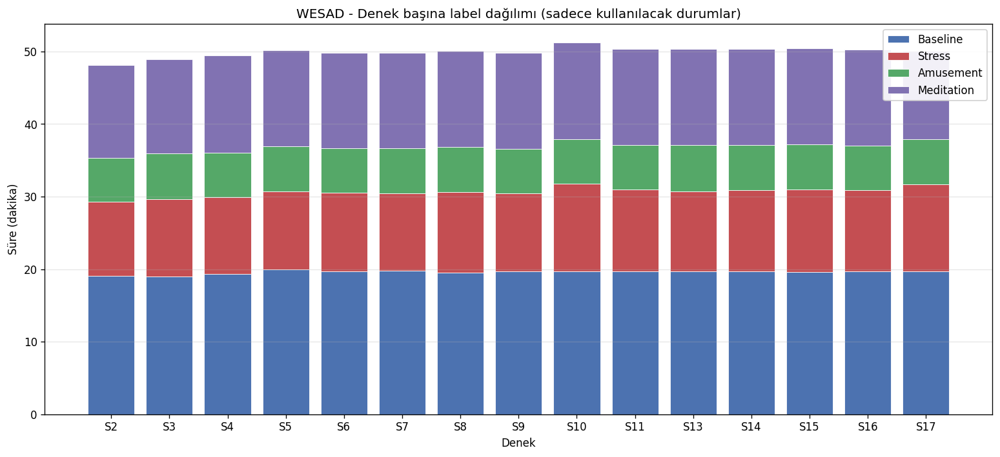
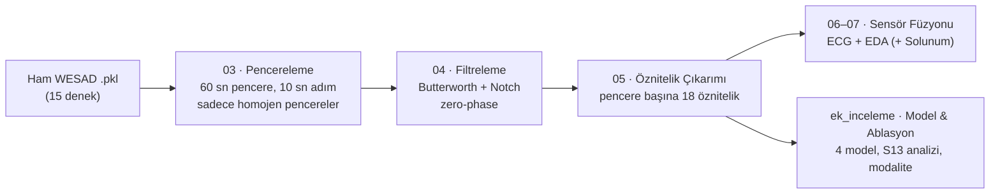
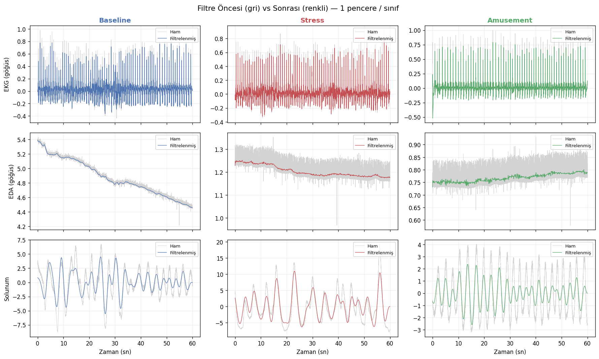
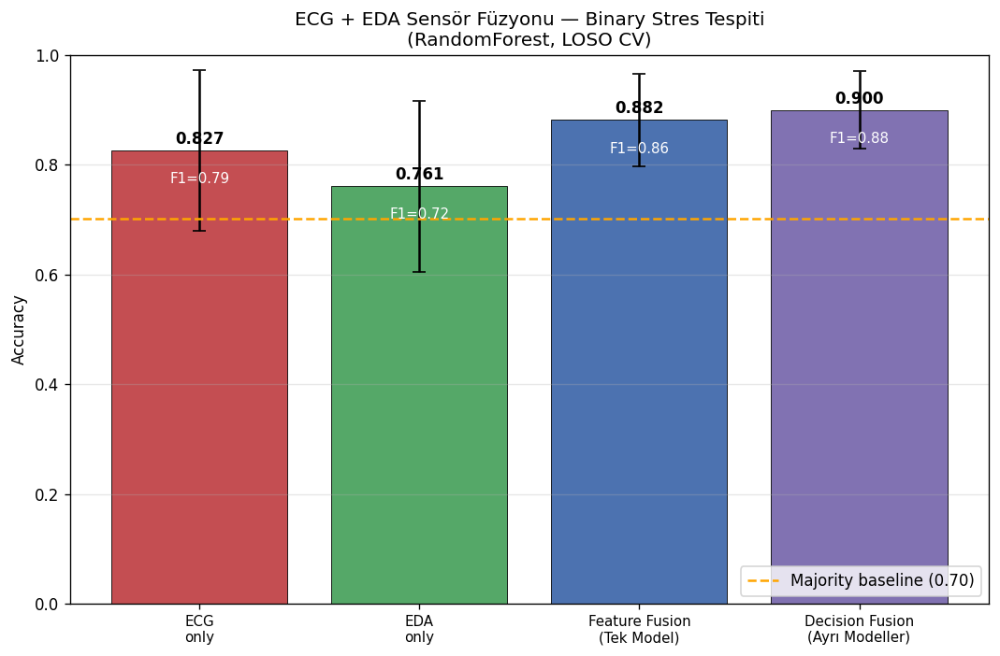
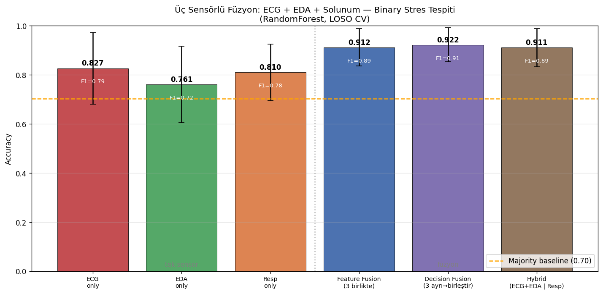
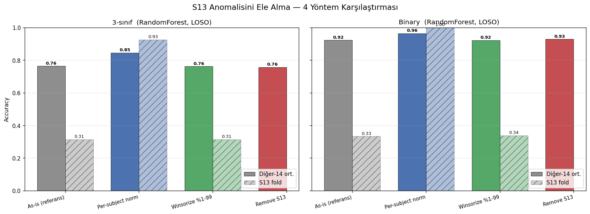
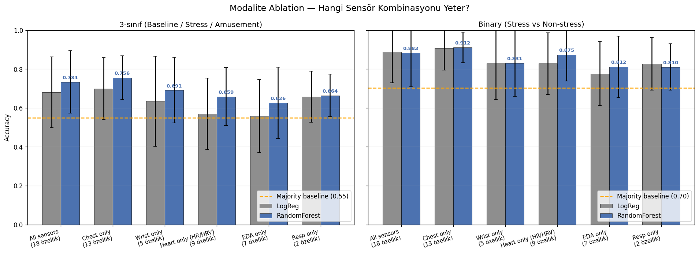

# WESAD ile Giyilebilir Sensörlerden Stres Tespiti

Giyilebilir biyosinyallerden (EKG, EDA, Solunum, PPG) **kişi-bağımsız stres tespiti**
yapan uçtan uca bir makine öğrenmesi hattı. Proje, ham sinyali yükleyip görselleştirmekten
başlayıp, pencereleme → filtreleme → öznitelik çıkarımı → **sensör füzyonu** ve model
karşılaştırmasına kadar tüm adımları kapsar.

> **Ders:** Giyilebilir Biyosinyal Sistemleri ve Uygulamaları (Yüksek Lisans)
> **Veri kümesi:** [WESAD — Wearable Stress and Affect Detection](https://archive.ics.uci.edu/dataset/465/wesad+wearable+stress+and+affect+detection) (15 denek, ~24 saat kayıt)
> **Asıl görev:** ECG + EDA sensör füzyonu ile stres tespiti (Tek Model vs. Ayrı Modeller)

<p>


</p>

---

## 🎯 Öne Çıkan Sonuçlar

| Görev | En İyi Yaklaşım | Doğruluk | Macro-F1 |
|---|---|:---:|:---:|
| **Binary stres tespiti** (3 sensör füzyonu) | Decision Fusion — ECG + EDA + Solunum ayrı modeller | **%92.2** | **0.906** |
| **Binary stres tespiti** (2 sensör füzyonu) | Decision Fusion — ECG + EDA ayrı modeller | **%90.0** | **0.878** |
| **S13 anomalisi düzeltildikten sonra** | Per-subject normalizasyon (binary) | **%96.6** | — |
| 3-sınıf (Baseline / Stress / Amusement) | RandomForest | %73.4 | 0.585 |

Tüm sonuçlar **LOSO (Leave-One-Subject-Out) çapraz doğrulama** ile elde edilmiştir;
yani her metrik "model **daha önce hiç görmediği bir kişide** nasıl çalışır?" sorusunun
cevabıdır. Bu, gerçek dünyaya en yakın ve en zorlu değerlendirme biçimidir.

**Üç temel bulgu:**
1. **Füzyon işe yarıyor.** Tek sensör (~%76–83) → iki sensör füzyonu (%90) → üç sensör füzyonu (%92). Her ek modalite tamamlayıcı bilgi katıyor.
2. **"Ayrı Modeller" (decision fusion) > "Tek Model" (feature fusion).** Olasılıkları ortalamak, özellikleri tek havuzda birleştirmekten tutarlı biçimde daha iyi.
3. **3-sınıf problem ~%73'te tıkanıyor**, çünkü *Baseline* ile *Amusement* fizyolojik olarak neredeyse aynı (ikisi de düşük uyarılma). Bu yüzden problem anlamlı olan **binary stres tespitine** indirgendi.

---

## 📊 Veri Kümesi: WESAD

[WESAD](https://archive.ics.uci.edu/dataset/465/wesad+wearable+stress+and+affect+detection),
laboratuvar ortamında 15 katılımcıdan iki giyilebilir cihazla eşzamanlı toplanmış
çok-modlu bir fizyolojik veri kümesidir.

| | Göğüs — **RespiBAN** | Bilek — **Empatica E4** |
|---|---|---|
| **Örnekleme** | 700 Hz (tümü) | BVP 64 Hz · EDA 4 Hz · TEMP 4 Hz · ACC 32 Hz |
| **Bu projede kullanılan** | EKG, EDA, Solunum | PPG/BVP, EDA |

- **15 denek** (S2–S17; S1 ve S12 veri kümesinde yok), ~24 saat toplam kayıt
- **Yaş:** ortalama 27.5 (24–35) · **Cinsiyet:** 12 erkek, 3 kadın
- **Durumlar (label):** `1` Baseline · `2` Stress (TSST) · `3` Amusement · `4` Meditation · `0/5–7` geçiş

> ⚠️ Veri kümesi **bu repoya dahil değildir** (`data/` ve `*.npz` `.gitignore`'da). WESAD'ı
> [resmi kaynaktan](https://archive.ics.uci.edu/dataset/465/wesad+wearable+stress+and+affect+detection)
> indirip `data/WESAD/S2/`, `data/WESAD/S3/` ... şeklinde açın. Veri kümesi yalnızca akademik/ticari-olmayan araştırma için lisanslıdır.

Denek başına demografi ve label dağılımı [`02_all_subjects_overview.py`](src/02_all_subjects_overview.py) ile çıkarılır:



---

## 🔬 İşlem Hattı (Pipeline)



Her adım kendi başına çalıştırılabilen, çıktısını bir sonrakine devreden ayrı bir script'tir:

| # | Script | Ne yapar | Çıktı |
|---|---|---|---|
| 01 | [`01_explore_subject.py`](src/01_explore_subject.py) | Tek deneği (S2) yükler, sinyalleri 3 durumda görselleştirir | `figures/01_*` |
| 02 | [`02_all_subjects_overview.py`](src/02_all_subjects_overview.py) | 15 deneği tarar, demografi + label dağılımı + veri-kalite uyarıları | `outputs/subjects_overview.csv` |
| 03 | [`03_windowing.py`](src/03_windowing.py) | Sinyalleri **60 sn / 10 sn adım** pencerelere böler, yalnızca tek-sınıflı pencereleri tutar | `outputs/windows.npz` (3040 pencere) |
| 04 | [`04_signal_filtering.py`](src/04_signal_filtering.py) | Her sinyali fizyolojik bandına göre **zero-phase** filtreler | `outputs/windows_filtered.npz` |
| 05 | [`05_features.py`](src/05_features.py) | Filtrelenmiş pencerelerden **18 öznitelik** (HRV, EDA, solunum, PPG) çıkarır | `outputs/features.csv` |
| 06 | [`06_fusion_comparison.py`](src/06_fusion_comparison.py) | **ECG + EDA füzyonu** (asıl görev): Tek Model vs. Ayrı Modeller | `outputs/fusion_results.csv` |
| 07 | [`07_three_sensor_fusion.py`](src/07_three_sensor_fusion.py) | 3. sensör olarak **Solunum** eklenir, 3 füzyon stratejisi | `outputs/fusion3_results.csv` |

### Pencereleme kararları ([`03`](src/03_windowing.py))
- **60 sn pencere, 10 sn adım** (50 sn örtüşme — literatürde yaygın), yalnızca sınıf `1/2/3`
- **Homojenlik filtresi:** pencere boyunca label değişmemeli (geçiş pencereleri atılır)
- **Senkronizasyon:** göğüs (700 Hz) ve bilek (64/4 Hz) sinyalleri aynı zaman aralığından kesilir
- Sonuç: **3040 pencere** → Baseline 1671 · Stress 904 · Amusement 465

### Filtreleme kararları ([`04`](src/04_signal_filtering.py))
Tüm filtreler **zero-phase** (`sosfiltfilt`) — sinyal şekli ve R-tepe konumları korunur:

| Sinyal | Filtre |
|---|---|
| EKG (700 Hz) | Band-pass 0.5–40 Hz + 50 Hz Notch (drift, kas, şebeke) |
| EDA göğüs (700 Hz) | Low-pass 5 Hz |
| Solunum (700 Hz) | Band-pass 0.1–0.35 Hz (yalnızca nefes bandı) |
| BVP bilek (64 Hz) | Band-pass 0.5–8 Hz |
| EDA bilek (4 Hz) | Low-pass 1 Hz |



### Öznitelikler ([`05`](src/05_features.py)) — pencere başına 18 sayı
- **EKG / HRV (7):** `hr_mean`, `hrv_sdnn`, `hrv_rmssd`, `hrv_pnn50`, `hrv_lf`, `hrv_hf`, `hrv_lfhf`
- **EDA göğüs (4):** `scl_mean`, `scl_std`, `scr_count`, `scr_mean_amp`
- **Solunum (2):** `resp_rate`, `resp_rate_std`
- **PPG bilek (2):** `bvp_hr_mean`, `bvp_hrv_sdnn`
- **EDA bilek (3):** `scl_w_mean`, `scl_w_std`, `scl_w_slope`

R-tepe ve SCR tespiti için [NeuroKit2](https://neurokit2.readthedocs.io/) kullanılır; HRV frekans-domeni özellikleri RR serisinin yeniden örneklenip Welch PSD'siyle hesaplanır.

---

## 🧪 Sensör Füzyonu Sonuçları (Asıl Görev)

Tüm füzyon deneyleri **RandomForest + LOSO CV** ile, binary stres tespitinde (Stress vs. Baseline+Amusement) yapılmıştır. Majority baseline ≈ %70.

### İki sensör: ECG + EDA ([`06`](src/06_fusion_comparison.py))

| Yaklaşım | Özellik | Doğruluk | Macro-F1 |
|---|:---:|:---:|:---:|
| ECG-only | 7 | 0.827 ± 0.146 | 0.795 |
| EDA-only | 4 | 0.761 ± 0.156 | 0.722 |
| Feature Fusion (**Tek Model**) | 11 | 0.882 ± 0.084 | 0.855 |
| **Decision Fusion (Ayrı Modeller)** | 11 | **0.900 ± 0.071** | **0.878** |



### Üç sensör: ECG + EDA + Solunum ([`07`](src/07_three_sensor_fusion.py))

| Yaklaşım | Özellik | Doğruluk | Macro-F1 |
|---|:---:|:---:|:---:|
| ECG-only | 7 | 0.827 | 0.795 |
| EDA-only | 4 | 0.761 | 0.722 |
| Resp-only | 2 | 0.810 | 0.784 |
| Feature Fusion (3 birlikte) | 13 | 0.912 ± 0.076 | 0.891 |
| **Decision Fusion (3 ayrı)** | 13 | **0.922 ± 0.069** | **0.906** |
| Hybrid (ECG+EDA \| Resp) | 13 | 0.911 ± 0.078 | 0.894 |



**Çıkarım:** Tek sensörden iki, iki sensörden üç sensöre geçildikçe doğruluk tutarlı biçimde
artar (%83 → %90 → %92). Her stratejide **"Ayrı Modeller" (decision-level fusion)**, özellikleri
tek havuzda toplayan **"Tek Model" (feature-level fusion)**'dan biraz daha iyi sonuç verir.

---

## 🔎 Ek İncelemeler (`src/ek_inceleme/`)

Asıl görevin ötesinde dört derinlemesine analiz:

### 1. S13 anomalisinin ele alınması — [`01_s13_handling.py`](src/ek_inceleme/01_s13_handling.py)
S13'ün bilek EDA sensörü bozuk (özelliklerde `|z| = 3.46` sapma). LOSO'da S13 fold'u
çöküyor (binary'de %33). Dört strateji kıyaslandı:

| Yöntem | Tüm ort. (binary) | Diğer-14 ort. | **S13 fold** |
|---|:---:|:---:|:---:|
| As-is (referans) | 0.883 | 0.923 | 0.333 |
| **Per-subject normalizasyon** | **0.966** | 0.964 | **1.000** |
| Winsorize %1–99 | 0.883 | 0.922 | 0.338 |
| Remove S13 | 0.929 | 0.929 | — |

> **Her deneği kendi içinde z-normalize etmek**, bozuk sensörlü S13'ü tamamen kurtarıyor
> (S13 fold %33 → %100) ve genel binary doğruluğu %96.6'ya çıkarıyor. Kişiselleştirilmiş
> normalizasyonun (calibration) giyilebilir cihazlarda neden önemli olduğunun net bir örneği.



### 2. Klasik ML benchmark'ı — [`02_classical_ml.py`](src/ek_inceleme/02_classical_ml.py)
3-sınıf problemde LogReg / RandomForest / SVM-RBF, 15-fold LOSO. *Amusement* sınıfının
*Baseline* ile karışması nedeniyle hepsi ~%73'te tıkanıyor (confusion matrix, per-subject
accuracy ve RF feature-importance görselleri üretilir).

### 3. İyileştirmeler: 3-sınıf vs Binary — [`03_improvements.py`](src/ek_inceleme/03_improvements.py)
HistGradientBoosting eklenip 4 model, hem 3-sınıf hem binary'de kıyaslanır:

| Model | 3-sınıf Acc | 3-sınıf F1 | Binary Acc | Binary F1 |
|---|:---:|:---:|:---:|:---:|
| RandomForest | **0.734** | 0.585 | 0.883 | 0.847 |
| HistGradBoost | 0.729 | 0.610 | 0.860 | 0.829 |
| LogReg | 0.681 | 0.627 | 0.888 | 0.874 |
| SVM-RBF | 0.655 | 0.609 | **0.889** | 0.866 |

> Aynı özelliklerle problem binary'ye indirgendiğinde tüm modeller ~%65–73'ten ~%86–89'a
> sıçrıyor — "stres var/yok" problemi anlamlı ölçüde daha öğrenilebilir.

### 4. Modalite ablasyonu — [`04_modality_ablation.py`](src/ek_inceleme/04_modality_ablation.py)
*"Fabrika işçisine sadece akıllı bileklik versek yeter mi?"* (RandomForest, LOSO):

| Modalite | Özellik | 3-sınıf | Binary |
|---|:---:|:---:|:---:|
| All sensors | 18 | 0.734 | 0.883 |
| **Chest only** | 13 | **0.756** | **0.912** |
| Wrist only (akıllı saat) | 5 | 0.691 | 0.831 |
| Heart only (HR/HRV) | 9 | 0.659 | 0.875 |
| EDA only | 7 | 0.626 | 0.812 |
| Resp only | 2 | 0.664 | 0.810 |

> **Yalnızca bilek** (akıllı saat) ile binary'de **%83.1** elde ediliyor — tüm sensörlerden
> sadece ~5 puan geride. Pratikte tek bir giyilebilir bileklik stres tespiti için makul.
> İlginç biçimde **Chest-only**, All-sensors'dan daha iyi: bozuk bilek EDA'sı gürültü kattığı
> için bazen daha az sensör daha iyi sonuç veriyor.



---

## 🚀 Kurulum ve Çalıştırma

### 1. Ortam
```bash
python -m venv .venv
.venv\Scripts\activate          # Windows (PowerShell: .venv\Scripts\Activate.ps1)
# source .venv/bin/activate     # Linux / macOS
pip install -r requirements.txt
```
Gereksinimler: `numpy`, `pandas`, `scipy`, `matplotlib`, `neurokit2`, `scikit-learn`, `tqdm` (Python 3.12).

### 2. Veriyi yerleştir
WESAD'ı indirip aç:
```
data/
└── WESAD/
    ├── S2/  S2.pkl, S2_readme.txt, ...
    ├── S3/  ...
    └── ...
```

### 3. Hattı sırayla çalıştır
```bash
python src/01_explore_subject.py        # tek denek görselleştirme
python src/02_all_subjects_overview.py  # demografi + label dağılımı
python src/03_windowing.py              # → outputs/windows.npz
python src/04_signal_filtering.py       # → outputs/windows_filtered.npz
python src/05_features.py               # → outputs/features.csv
python src/06_fusion_comparison.py      # asıl görev: ECG+EDA füzyonu
python src/07_three_sensor_fusion.py    # + Solunum

# Ek incelemeler (05'ten sonra, herhangi bir sırada):
python src/ek_inceleme/01_s13_handling.py
python src/ek_inceleme/02_classical_ml.py
python src/ek_inceleme/03_improvements.py
python src/ek_inceleme/04_modality_ablation.py
```

> 03 ve 04 büyük `.npz` dosyaları üretir (toplam ~2 GB); bunlar `.gitignore`'dadır.
> 05'ten itibaren her şey hafif `features.csv` (≈1 MB) üzerinden çalışır.

---

## 📁 Repo Yapısı

```
wesad_stress_ml/
├── src/
│   ├── 01_explore_subject.py        # tek denek inceleme + görselleştirme
│   ├── 02_all_subjects_overview.py  # 15 denek tarama, demografi
│   ├── 03_windowing.py              # pencereleme → windows.npz
│   ├── 04_signal_filtering.py       # zero-phase filtreleme
│   ├── 05_features.py               # 18 öznitelik → features.csv
│   ├── 06_fusion_comparison.py      # ECG+EDA füzyonu (asıl görev)
│   ├── 07_three_sensor_fusion.py    # +Solunum, 3 strateji
│   └── ek_inceleme/                 # ek derinlemesine analizler
│       ├── 01_s13_handling.py       # bozuk sensör anomalisi
│       ├── 02_classical_ml.py       # 3 model benchmark
│       ├── 03_improvements.py       # 4 model, 3-sınıf vs binary
│       └── 04_modality_ablation.py  # hangi sensör yeter?
├── outputs/                         # CSV sonuçları (versiyonlanır; .npz hariç)
├── figures/                         # üretilen PNG görseller
├── data/                            # WESAD (.gitignore — siz ekleyin)
├── requirements.txt
└── README.md
```

---

## 🛠 Metodolojik Notlar

- **LOSO (Leave-One-Subject-Out) CV:** Eğitim ve test asla aynı kişiyi paylaşmaz; raporlanan her metrik **kişi-bağımsız** genellemeyi ölçer. Fizyolojik sinyallerde kişiden kişiye değişkenlik yüksek olduğu için bu, k-fold'dan çok daha dürüst (ve zorlu) bir değerlendirmedir.
- **Veri sızıntısı (leakage) yok:** `StandardScaler`, winsorize sınırları ve modeller her fold'da yalnızca eğitim verisine fit edilir.
- **Sınıf dengesizliği:** tüm modellerde `class_weight="balanced"`.
- **Tekrarlanabilirlik:** `random_state=42` her yerde sabit.

## ⚠️ Sınırlamalar
- 15 denek, çoğunlukla genç ve erkek (12E/3K) — popülasyon dar.
- Stres tek bir paradigmadan (TSST) gelir; gerçek dünya stresörlerine genelleme test edilmedi.
- 3-sınıf ayrımı *Baseline*–*Amusement* fizyolojik benzerliği nedeniyle sınırlı (~%73).

---

## 📚 Kaynak

Veri kümesini kullanırsanız orijinal makaleyi atıfla anın:

> Schmidt, P., Reiss, A., Duerichen, R., Marberger, C., & Van Laerhoven, K. (2018).
> *Introducing WESAD, a Multimodal Dataset for Wearable Stress and Affect Detection.*
> Proceedings of the 20th ACM International Conference on Multimodal Interaction (ICMI '18).

## 👤 Yazar

**Ahmet Tayyip Uzun** — Giyilebilir Biyosinyal Sistemleri ve Uygulamaları (Yüksek Lisans ders projesi)

## 📄 Lisans

Bu repodaki kod eğitim amaçlıdır. **WESAD veri kümesi** kendi lisans koşullarına tabidir
(yalnızca ticari-olmayan akademik araştırma). Kodu yeniden kullanırken bunu göz önünde bulundurun.
